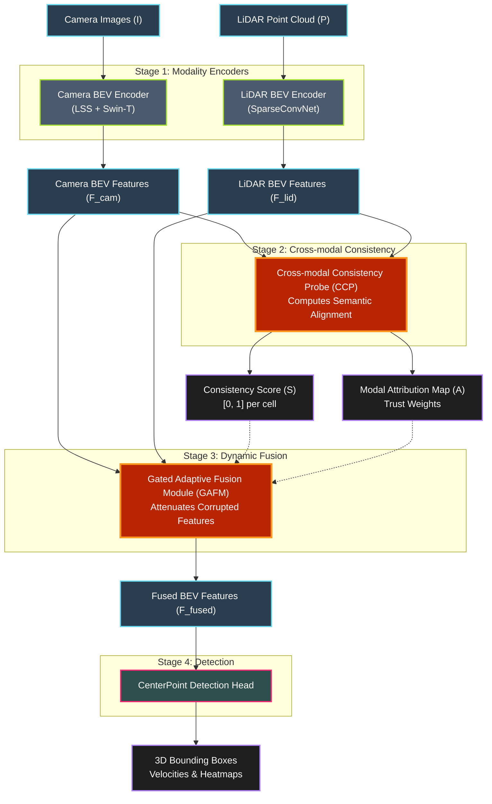

```mermaid
graph TD
    %% Define styles
    classDef inputStyle fill:#2b3e50,stroke:#66d9ef,stroke-width:2px,color:#fff;
    classDef encoderStyle fill:#4b5a6c,stroke:#a6e22e,stroke-width:2px,color:#fff;
    classDef novelStyle fill:#b82601,stroke:#fd971f,stroke-width:3px,color:#fff;
    classDef headStyle fill:#2f4f4f,stroke:#f92672,stroke-width:2px,color:#fff;
    classDef outputStyle fill:#1e1e1e,stroke:#ae81ff,stroke-width:2px,color:#fff;

    %% Nodes
    I["Camera Images (I)"]:::inputStyle
    P["LiDAR Point Cloud (P)"]:::inputStyle

    subgraph Stage 1: Modality Encoders
        CamEnc["Camera BEV Encoder\n(LSS + Swin-T)"]:::encoderStyle
        LidEnc["LiDAR BEV Encoder\n(SparseConvNet)"]:::encoderStyle
    end

    F_cam["Camera BEV Features (F_cam)"]:::inputStyle
    F_lid["LiDAR BEV Features (F_lid)"]:::inputStyle

    subgraph Stage 2: Cross-modal Consistency
        CCP["Cross-modal Consistency Probe (CCP)\nComputes Semantic Alignment"]:::novelStyle
    end

    S["Consistency Score (S)\n[0, 1] per cell"]:::outputStyle
    A["Modal Attribution Map (A)\nTrust Weights"]:::outputStyle

    subgraph Stage 3: Dynamic Fusion
        GAFM["Gated Adaptive Fusion Module (GAFM)\nAttenuates Corrupted Features"]:::novelStyle
    end

    F_fused["Fused BEV Features (F_fused)"]:::inputStyle

    subgraph Stage 4: Detection
        DetHead["CenterPoint Detection Head"]:::headStyle
    end

    Out["3D Bounding Boxes\nVelocities & Heatmaps"]:::outputStyle

    %% Edges
    I --> CamEnc
    P --> LidEnc
    
    CamEnc --> F_cam
    LidEnc --> F_lid

    F_cam --> CCP
    F_lid --> CCP

    CCP --> S
    CCP --> A

    F_cam --> GAFM
    F_lid --> GAFM
    S -.-> GAFM
    A -.-> GAFM

    GAFM --> F_fused
    F_fused --> DetHead
    DetHead --> Out
```
